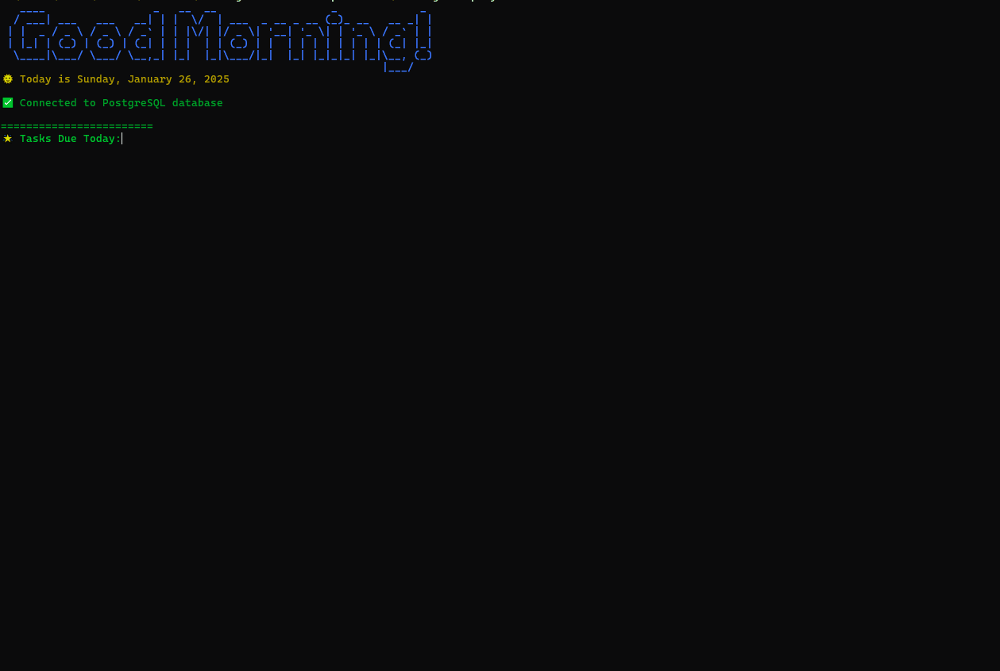

# **Morning Terminal Script**

This project is a fun and interactive script that runs every morning on your terminal. It generates a visually appealing monthly calendar with your tasks, highlights important days, and provides a motivational start to your day. The script integrates with a PostgreSQL database to manage tasks.



---

## **Features**
- **Monthly Calendar**: Displays tasks for the entire month in a horizontal calendar format.
- **Task Highlights**:
  - Yellow for days with exactly 3 tasks.
  - Red for days with more than 5 tasks.
- **Superscript Dates**: Dates are displayed in superscript format (e.g., `⁵`, `²`).
- **PostgreSQL Integration**: Fetches tasks from a PostgreSQL database.
- **Scheduled Execution**: Automatically runs every morning on system startup using Windows Task Scheduler.
- **Environment Configuration**: Customize environment variables (e.g., database connection settings) using `env.js`.

---

## **Setup Instructions**

### **Prerequisites**
1. **Node.js**: Make sure you have Node.js installed on your system. You can download it from [Node.js official website](https://nodejs.org/).

2. **PostgreSQL Database**: Ensure you have access to a PostgreSQL database. The schema for the `tasks` table is provided below.

3. **Windows PowerShell**: Ensure PowerShell is available on your system (default on most Windows installations).

4. **Windows Task Scheduler**: This is used to schedule the script to run daily at startup.

---

### **Installation**
1. Clone or download this repository to your local machine:
   ```bash
   git clone <repository-url>
   cd morning-terminal-script
   ```

2. Install dependencies:
   ```bash
   npm install chalk figlet pg
   ```

3. Configure environment variables:
   - Edit the `env.js` file to include your PostgreSQL database credentials and other configurations:

4. Set up the PostgreSQL database (schema provided below).

---

### **Database Schema**
This project uses a PostgreSQL database to store tasks. The schema for the `tasks` table is as follows:

```sql
CREATE TABLE tasks (
    kind TEXT,
    id TEXT PRIMARY KEY,
    etag TEXT,
    title TEXT,
    updated TIMESTAMP,
    status TEXT,
    due TIMESTAMP,
    tasklist_title TEXT
);
```

Each task has the following fields:
- `kind`: Type of task (e.g., `'tasks#task'`).
- `id`: Unique identifier for the task.
- `etag`: Entity tag for versioning.
- `title`: Title of the task.
- `updated`: Timestamp of when the task was last updated.
- `status`: Status of the task (e.g., `'needsAction'` or `'completed'`).
- `due`: Due date of the task.
- `tasklist_title`: Title of the task list (e.g., `'My Tasks'`).

---

### **Running the Script Manually**
To test the script manually, run the following command in your terminal:
```bash
node morning-script.js
```

---

### **Automating the Script with Windows Task Scheduler**

The project includes a PowerShell script (`create-task.ps1`) that creates a scheduled task in Windows Task Scheduler to run the script daily at startup.

#### Steps:
1. Open PowerShell as Administrator.

2. Navigate to the project directory:
   ```bash
   cd C:\Users\Lucas\.Lucas\2025Code\morning-terminal-script
   ```

3. Run the PowerShell script to create the scheduled task:
   ```bash
   .\create-task.ps1
   ```

4. Verify that the task has been created:
   - Open Windows Task Scheduler.
   - Look for a task named `MorningTerminalScript` (or the name specified in `create-task.ps1`).

5. The script will now run automatically every day at startup.

---

### **Project Structure**
```
C:\Users\Lucas\.Lucas\2025Code\morning-terminal-script\
│
├── generated_text_elements/      # Directory for generated text files (if applicable)
├── .gitignore                    # Git ignore file
├── create-task.ps1               # PowerShell script to create a scheduled task
├── env copy.js                   # Example environment configuration file
├── env.js                        # Environment configuration file (customizable)
├── morning-script.js             # Main JavaScript script for generating the calendar and fetching tasks from DB
├── package-lock.json             # Auto-generated file for npm dependencies
├── package.json                  # Node.js project configuration file
├── README.md                     # Project documentation (this file)
├── run.bat                       # Batch file to execute run2.bat the script via Task Scheduler
├── run2.bat                      # Calls morning-script.js
```

### **Example Output**


When you run the script, you’ll see something like this:

```
┌───────────────────────────────────────────────────────────┐
│   Sun   Mon   Tue   Wed   Thu   Fri   Sat                │
├───────────────────────────────────────────────────────────┤
│       Task 1 ⁵                                           │
│       Task 2, Task 3 ¹⁵                                  │
│                                                           │
│       Task 4 ²⁰                                           │
│                                                           │
└───────────────────────────────────────────────────────────┘

🌟 Tasks Due Today:
Total: 2 🗓️

⚠️ Overdue Tasks:
Total: 1 ⏳

💡 Motivational Quote of the Day:
"The secret of getting ahead is getting started." – Mark Twain

✅ Connection closed
```

---

### **Troubleshooting**
1. If the script does not run as expected:
   - Ensure that Node.js is installed and added to your system's PATH.
   - Check if `create-task.ps1` was executed with Administrator privileges.
   - Verify that all required dependencies are installed using `npm install`.

2. To debug issues with Task Scheduler:
   - Open Task Scheduler and review history/logs for your scheduled task.
   - Ensure that `run.bat` points to the correct path for `node.exe` and `morning-script.js`.
